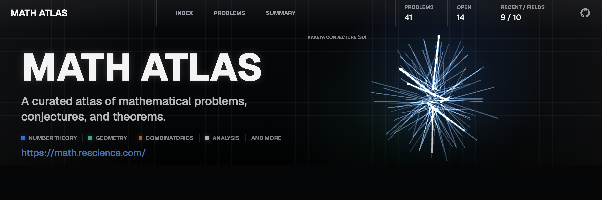

# Math Atlas

A visual directory of mathematical discoveries, open problems, and the people behind them.

## Local Development

```bash
bun install
bun run dev
```

Open `http://localhost:3000`.

## Build

```bash
bun run lint
bunx tsc --noEmit
bun run build
```

## Social Images

```bash
bun run social
```

The source HTML lives at `assets/social/banner.html` and renders
`public/og.png` and `public/github-banner.png` at 2x resolution with 300 DPI PNG metadata.

## Deployment

The project is configured for Vercel with Bun via `vercel.json`.

```bash
vercel deploy --prod
```
